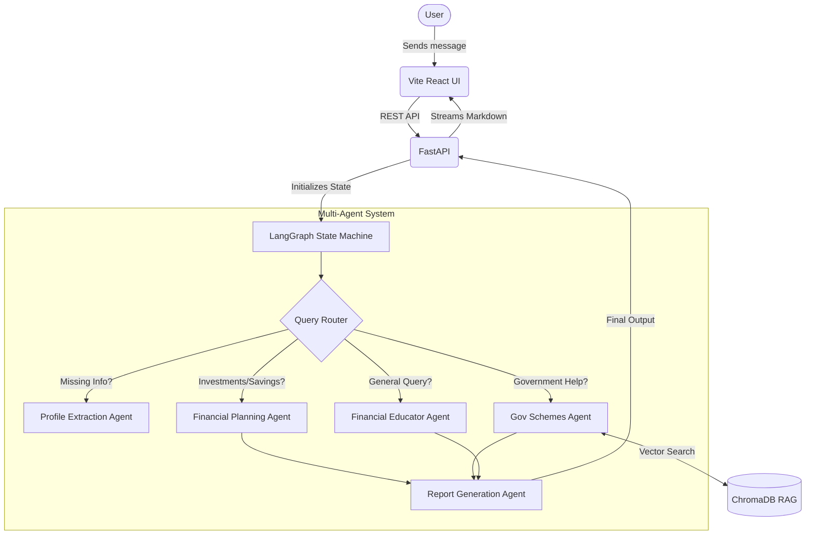

# 🌾 FinSahayak AI

FinSahayak AI is an autonomous, multi-agent financial advisory platform designed specifically for rural communities, farmers, and underserved populations. It bridges the financial literacy gap by providing localized, accessible, and highly contextual financial advice, government scheme recommendations, and anti-scam protection.

This project was built as a Capstone Project focusing on autonomous AI agents, retrieval-augmented generation (RAG), and full-stack system design.

## 🏗️ Architecture

FinSahayak uses a **LangGraph-powered multi-agent architecture** to route, analyze, and synthesize user queries into actionable financial plans.



## 🛠️ Tech Stack

- **Frontend:** React, Vite, TailwindCSS
- **Backend:** FastAPI, Python, SQLite (Conversation Memory)
- **AI Orchestration:** LangGraph, LangChain
- **LLM Providers:** Google Gemini, Groq
- **Vector Database:** ChromaDB (for RAG on Government Schemes)
- **Deployment:** Docker, Docker Compose, Nginx, AWS EC2

## ✨ Key Features

- **Context-Aware Memory:** The AI remembers the user's occupation, location, and income volatility across conversations.
- **Liquidity Mandates:** Strictly prevents locking rural users' funds in illiquid assets if they suffer from seasonal income fluctuations.
- **Anti-Scam Protection:** Proactively detects and warns users about unregulated chit funds and ponzi schemes.
- **Accessibility Formatting:** Generates advice without complex tables or nested lists, optimizing for text-to-speech screen readers and low-literacy users.
- **Dynamic Translation:** Automatically detects the user's language (e.g., Kannada, Hindi) and responds natively.

## 🚀 Local Development Setup

### 1. Backend Setup
```bash
cd backend
python -m venv venv
source venv/bin/activate
pip install -r requirements.txt

# Create a .env file and add your API keys:
# GEMINI_API_KEY=your_key
# GROQ_API_KEY=your_key
# DATABASE_URL="sqlite:///./finsahayak.db"
# SECRET_KEY="your_secret"

uvicorn app.main:app --reload --port 8000
```

### 2. Frontend Setup
```bash
cd frontend
npm install
npm run dev
```

## 🐳 Production Deployment (Docker/AWS)

FinSahayak is fully dockerized and ready for cloud deployment. The frontend is served via an Nginx reverse proxy to eliminate CORS issues and route `/api` traffic natively.

```bash
# Clone the repository on your server
git clone https://github.com/Archit-P-Singh/FinSahayak.git
cd FinSahayak

# Build and run the containers in detached mode
docker compose up -d --build
```

> **Note:** If deploying on an AWS `t2.micro` (Free Tier), ensure you have allocated a Swap File or expanded your EBS volume, as the PyTorch and ChromaDB dependencies require significant disk space.
